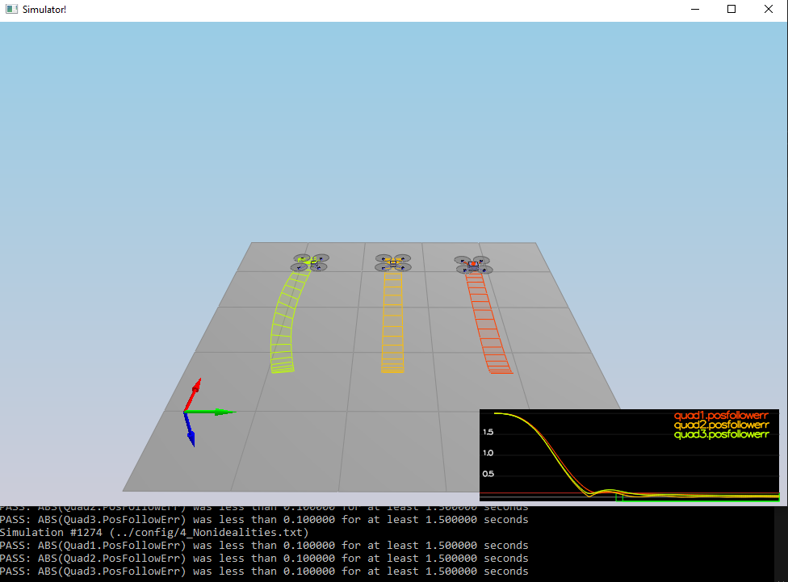

# Control of the 3D Quadrotor Project #

This document aims to show the results of all the tasks necessary to complete the project.

## The Tasks ##


### Intro (scenario 1) ###

To complete this task it is only necessary to set the mass of the quadcopter in the `QuadControlParams.txt` file.
In the image below it can be seen how the controller pass the test.


### Body rate and roll/pitch control (scenario 2) ###

In this scenario, a quad remains still above the origin.  It is created with a small initial rotation speed about its roll axis.  The controller has to stabilize the rotational motion and bring the vehicle back to level attitude.

These are the steps to accomplish this:

* Implement the function `GenerateMotorCommands()` to control the thrust of the motors.
* Implement the **Body Rate Controler** in the function `BodyRateControl()`. 
* Tune `kpPQR` in `QuadControlParams.txt` to get the vehicle to stop spinning quickly but not overshoot.
* Implement the **Roll/Pitch Controller** in the function `RollPitchControl()`
* Tune `kpBank` in `QuadControlParams.txt` to minimize settling time but avoid too much overshoot.

Below is the test result.


### Position/velocity and yaw angle control (scenario 3) ###

This scenario includes 2 identical quads, one offset from its target point (but initialized with yaw = 0) and second offset from target point but yaw = 45 degrees.
Both quads should go to their destination points and also both quads must end with the same yaw angle.

To achieve it:
* Implement the **XY position Controller** in the function `LateralPositionControl()`.
* Implement the **Z position Controller** in the function `AltitudeControl()`.
* Tune parameters `kpPosZ` and `kpPosZ` in `QuadControlParams.txt` to tune the first controller.
* Tune parameters `kpVelXY` and `kpVelZ` in `QuadControlParams.txt` to tune the second one.
* Implement the **Yaw Controller** in the function `YawControl()`.
* Tune parameters `kpYaw` and the 3rd (z) component of `kpPQR` in `QuadControlParams.txt` to adjust the yaw angle.


### Non-idealities and robustness (scenario 4) ###

This part is to explore some of the non-idealities and robustness of a controller.  
The scenario consist in a configuration with 3 quads that are all are trying to move one meter forward.
These quads are not the same have the following differences:
* The green quad has its center of mass shifted back.
* The orange vehicle is an ideal quad.
* The red vehicle is heavier than usual.

To pass the test, I had to better adjust the parameters of the controllers in `scenario 3`. 



### Tracking trajectories (scenario 5) ###

This scenario has two quadcopters which try to follow a different path:
* The orange follows `traj/FigureEight.txt` file.
* The yellow follows `traj/FigureEightFF.txt`.

In the image below can be seen how the how the yellow path is followed perfectly but with the orange the error is very big.


### Extra Challenge 1 (Optional) ###

The two trajectories of the previous point were apparently the same, but comparing the files
`FigureEight.txt` and `FigureEightFF.txt` it can be seen how the second one has velocity values 
​​also in the trajectory while the first one only of positions.

To try to improve the behavior of the drone in the orange trajectory, the script `traj/MakePeriodicTrajectory.py`
has been modified to generate a new `FigureEight.txt`. 
The following code has been added to the script. The derivative of the position values has been
used as velocity values.

```python
######## BEGIN STUDENT CODE
vx = (2 * math.pi / period[0]) * math.cos(t * 2 * math.pi / period[0] + phase[0]) * radius * amp[0] + center[0]
vy = (2 * math.pi / period[1]) * math.cos(t * 2 * math.pi / period[1] + phase[1]) * radius * amp[1] + center[1]
vz = (2 * math.pi / period[2]) * math.cos(t * 2 * math.pi / period[2] + phase[2]) * radius * amp[2] + center[2]
######## END STUDENT CODE
```

In the image below it can be seen how the drone error in the new trajectory ends up being less than in the old one.


